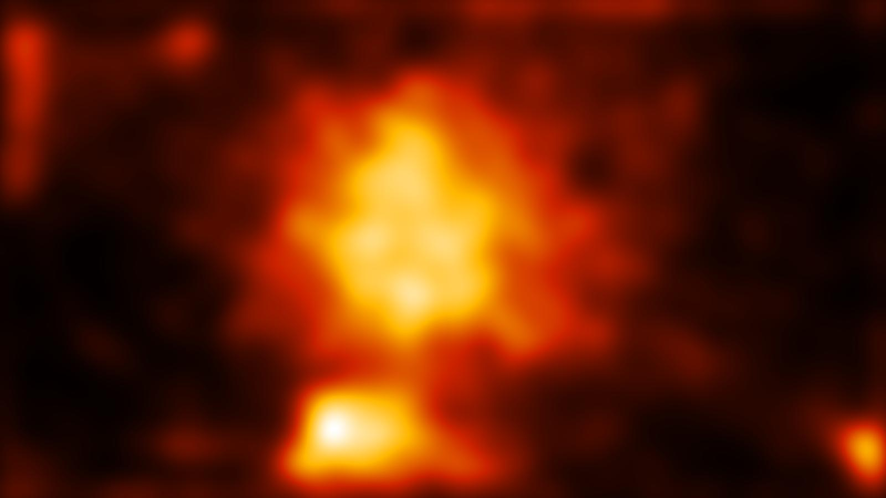
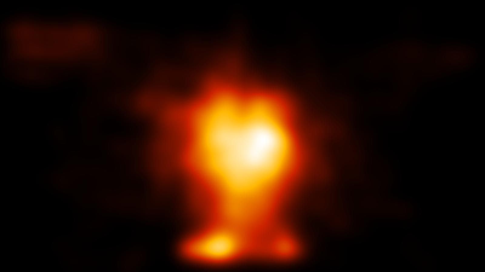
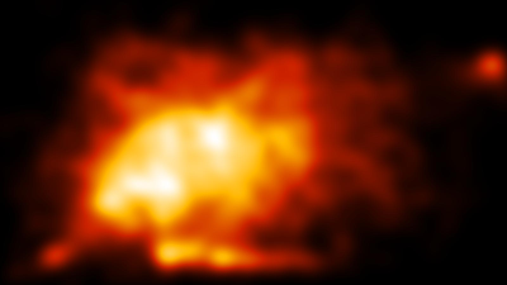

# mousetracker

Captures mouse movements and visualizes them.

## Requirements

* PyUserInput
* Pillow
* numpy

## Usage

Execute the `mousetracker.py` script to capture mouse movements. `traceplot.py` generates an image with the trace and `heatmap.py` images with a histogram and the heatmap.

Note that the console output of the `heatmap.py` script is designed for linux bash.

## Example Heatmaps

